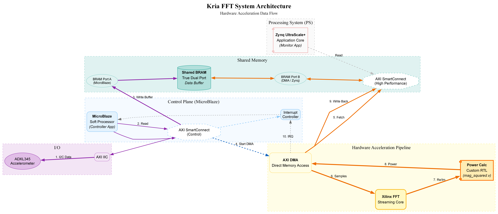

# Kria FFT - Hardware & Software Acceleration System
# ==================================================

This project implements a high-performance **FFT-based signal processing system** on the Xilinx Kria KR260 Robotics Starter Kit. 

It upgrades the standard "Processor-Only" approach by offloading the heavy computational tasks (FFT and Power Calculation) to a dedicated **Hardware Acceleration Pipeline** in the FPGA fabric, orchestrated by a MicroBlaze Soft Processor and monitored by the Zynq MPSoC.



## System Architecture

The design uses a **Memory-Centric Data Flow** that decouples data acquisition from processing, allowing for maximum throughput.

### 1. Control Plane (MicroBlaze)
*   **Role**: The "Conductor" of the orchestra.
*   **tasks**:
    *   Configures the Peripherals (I2C, DMA, Interrupt Controller).
    *   Acquires sensor data (ADXL345) via I2C.
    *   **Buffers data** into Shared BRAM (Port A).
    *   **Commands the DMA** to start processing.
    *   Signals the PS when results are ready.

### 2. High-Speed Data Plane (Hardware Pipeline)
*   **Role**: The "Heavy Lifter".
*   **DMA (Direct Memory Access)**: Moves data between BRAM and the Streaming Pipeline without using processor cycles.
*   **Xilinx FFT IP**: Performs a streaming Fast Fourier Transform.
*   **Custom Power Block (`mag_squared.v`)**: Calculates the Power Magnitude ($Real^2 + Imag^2$) in hardware, pipelined with the FFT.

### 3. Monitoring Plane (Zynq MPSoC / PS)
*   **Role**: The "Consumer" / Application Layer.
*   **Tasks**:
    *   Polls the Shared BRAM for a "Ready" flag from the MicroBlaze.
    *   Reads the final frequency-domain results from BRAM (Port B).
    *   Performs high-level application logic (e.g., peak detection, logging, network streaming).

## Data Flow Sequence

The system operates in a continuously looping **10-Step Sequence**:

1.  **Acquisition**: Sensor -> I2C -> MicroBlaze.
2.  **Buffering**: MicroBlaze writes samples to **Shared BRAM (Port A)**.
3.  **Command**: MicroBlaze commands the **AXI DMA** (via AXI-Lite) to start a transfer.
4.  **Fetch**: DMA reads the samples from **Shared BRAM (Port B)** (MM2S Channel).
5.  **Stream**: DMA streams samples to the **FFT IP**.
6.  **Transform**: FFT IP outputs Real/Imag frequency components.
7.  **Power Calc**: Custom block computes Magnitude ($Re^2 + Im^2$).
8.  **Write Back**: DMA writes the results back to **Shared BRAM (Port B)** (S2MM Channel).
9.  **Interrupt**: DMA signals "Done" to MicroBlaze via Interrupt Controller.
10. **Handoff**: MicroBlaze sets a flag in BRAM; Zynq PS reads the result.

## Directory Structure

| File | Description |
| :--- | :--- |
| `build_complete_system.tcl` | **Master Build Script**: Creates the entire Vivado project, Block Design (FFT+DMA+MicroBlaze), and bitstream. |
| `server_build.tcl` | **Headless Build**: Script to run synthesis/implementation on a remote server/CI pipeline. |
| `mag_squared.v` | **RTL Core**: Custom Verilog module for hardware power calculation. |
| `sw/main_mb.c` | **MicroBlaze App**: Controls acquisition and DMA orchestration. |
| `sw/main_ps.c` | **Zynq PS App**: Consumes and displays the final results. |
| `adxl345.xdc` | **Constraints**: Pin definitions for the PMOD I2C interface. |
| `generate_diagram.py` | **Documentation**: Python script to generate the architecture diagram. |

## Quick Start (Hardware Build)

### 1. Build the Design (Vivado)
Open Vivado 2025.2 Tcl Console and run:
```tcl
cd Kria_FFT
source build_complete_system.tcl
```
*   This will create the project, add all IPs (FFT, DMA, MicroBlaze), connect the custom RTL, and launch synthesis.*

**(Optional) Headless Build:**
To build on a server without opening the GUI:
```bash
vivado -mode batch -source server_build.tcl
```

### 2. Run the Software (Vitis)
You will need to create **Two Applications** in Vitis 2025.2:

1.  **Platform**: Create a platform from the exported `.xsa` (Hardware).
2.  **App 1 (MicroBlaze)**:
    *   Select the `microblaze_0` processor.
    *   Import `sw/main_mb.c` as the source.
3.  **App 2 (Zynq PS)**:
    *   Select the `psu_cortexa53_0` processor.
    *   Import `sw/main_ps.c` as the source.

**Run Order**:
1.  Program the Bitstream.
2.  Launch the MicroBlaze App (starts acquisition loop).
3.  Launch the PS App (starts monitoring output).

## Hardware Requirements
*   **Board**: Xilinx Kria KR260 Robotics Starter Kit.
*   **Sensor**: Analog Devices ADXL345 (PMOD Interface).
